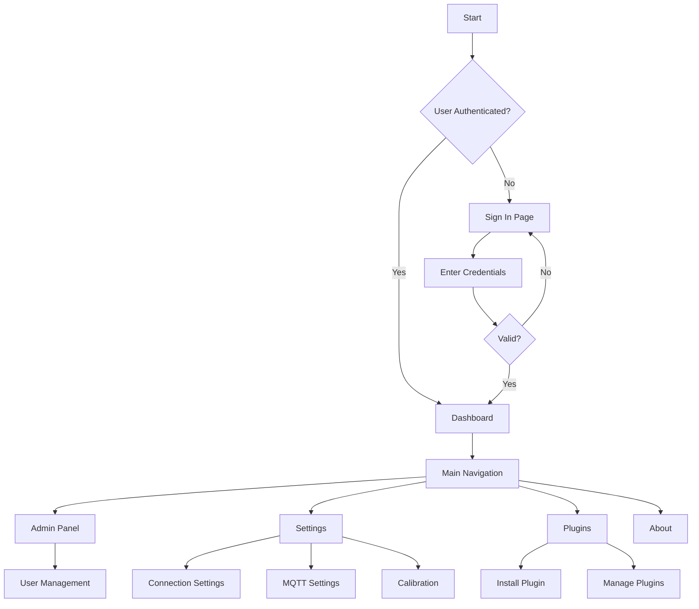

# MEDLABX Visual Guide
*Interface Screenshots and Navigation Flow Diagrams*

---

## Application Flow Diagram



---

## Interface Screenshots

### 1. Sign In Page
```
┌─────────────────────────────────────────────────────────────┐
│                        🏥 MEDLABX                          │
│                    Laboratory Management                    │
├─────────────────────────────────────────────────────────────┤
│                                                             │
│                     Sign In to Continue                     │
│                                                             │
│    📧 Email Address                                         │
│    ┌─────────────────────────────────────────────────────┐   │
│    │ user@example.com                                    │   │
│    └─────────────────────────────────────────────────────┘   │
│                                                             │
│    🔒 Password                                              │
│    ┌─────────────────────────────────────────────────────┐   │
│    │ ••••••••••••                                        │   │
│    └─────────────────────────────────────────────────────┘   │
│                                                             │
│    ┌─────────────────┐  ┌─────────────────┐                │
│    │   🔑 Sign In    │  │   📝 Sign Up    │                │
│    └─────────────────┘  └─────────────────┘                │
│                                                             │
│               🔗 Forgot your password?                      │
│                                                             │
└─────────────────────────────────────────────────────────────┘
```

### 2. Main Dashboard
```
┌─────────────────────────────────────────────────────────────┐
│ 🏥 MEDLABX    👤 John Doe    🔔 3    🔌 Connected    ⚙️    │
├─────────────────────────────────────────────────────────────┤
│                                                             │
│  📊 System Overview                 Real-time: [ON] ──●──   │
│  ┌─────────────────────────────────────────────────────────┐ │
│  │                                                         │ │
│  │  🖥️  CPU Usage: ██████░░░░ 60%                          │ │
│  │  💾  Memory: ████████░░ 80%                             │ │
│  │  🌐  Network: ███░░░░░░░ 30%                            │ │
│  │                                                         │ │
│  │  📈 Data Throughput: 1.2 MB/s                          │ │
│  │  📊 Active Connections: 12                             │ │
│  │                                                         │ │
│  └─────────────────────────────────────────────────────────┘ │
│                                                             │
│  🔌 Plugin Status                                          │
│  ┌─────────────────┐ ┌─────────────────┐ ┌─────────────────┐ │
│  │ Data Analyzer   │ │ Report Builder  │ │ MQTT Handler    │ │
│  │ ✅ Active       │ │ ✅ Active       │ │ ⚠️ Warning      │ │
│  │ v1.2.3         │ │ v2.1.0         │ │ v1.0.1         │ │
│  └─────────────────┘ └─────────────────┘ └─────────────────┘ │
│                                                             │
└─────────────────────────────────────────────────────────────┘
```

### 3. User Management (Admin)
```
┌─────────────────────────────────────────────────────────────┐
│ 👥 User Management                           [+ Add User]   │
├─────────────────────────────────────────────────────────────┤
│                                                             │
│  Search: [_________________] 🔍    Filter: [All Roles ▼]   │
│                                                             │
│  Users Table:                                              │
│  ┌────┬─────────────┬──────────────────┬─────────┬────────┐  │
│  │ ID │ Name        │ Email            │ Role    │ Action │  │
│  ├────┼─────────────┼──────────────────┼─────────┼────────┤  │
│  │001 │ John Smith  │ john@medlab.com  │ 👑 Admin│ ✏️ 🗑️  │  │
│  │002 │ Jane Doe    │ jane@medlab.com  │ 👤 User │ ✏️ 🗑️  │  │
│  │003 │ Bob Wilson  │ bob@medlab.com   │ 👀 View │ ✏️ 🗑️  │  │
│  │004 │ Alice Brown │ alice@medlab.com │ 👤 User │ ✏️ 🗑️  │  │
│  └────┴─────────────┴──────────────────┴─────────┴────────┘  │
│                                                             │
│  📊 Statistics:                                            │
│  Total Users: 156  |  Active: 142  |  Inactive: 14        │
│                                                             │
└─────────────────────────────────────────────────────────────┘
```

### 4. Settings Configuration
```
┌─────────────────────────────────────────────────────────────┐
│ ⚙️ Settings Configuration                                   │
├─────────────────────────────────────────────────────────────┤
│                                                             │
│  📝 Tabs: [Connection] [MQTT] [Serial] [Calibration]      │
│                                                             │
│  🌐 Connection Settings                                    │
│  ┌─────────────────────────────────────────────────────────┐ │
│  │                                                         │ │
│  │  Server Address: [api.medlabx.com          ]           │ │
│  │  Port Number:    [443        ]                         │ │
│  │  Protocol:       [HTTPS ▼]                             │ │
│  │  Timeout:        [30] seconds                          │ │
│  │                                                         │ │
│  │  Connection Status: 🟢 Connected                       │ │
│  │  Last Check: 2 minutes ago                             │ │
│  │                                                         │ │
│  │  [Test Connection]  [Save Settings]                    │ │
│  │                                                         │ │
│  └─────────────────────────────────────────────────────────┘ │
│                                                             │
│  📡 Quick Actions                                          │
│  [🔄 Reconnect] [📊 Diagnostics] [🔧 Advanced]            │
│                                                             │
└─────────────────────────────────────────────────────────────┘
```

### 5. Plugin Management
```
┌─────────────────────────────────────────────────────────────┐
│ 🔌 Plugin Management                                        │
├─────────────────────────────────────────────────────────────┤
│                                                             │
│  [📦 Installed] [🌐 Available] [📁 Upload]                │
│                                                             │
│  📦 Installed Plugins                                      │
│  ┌─────────────────────────────────────────────────────────┐ │
│  │ 🔧 Advanced Data Processor                    v2.1.4    │ │
│  │    Status: ✅ Active  |  Last Used: 5 min ago          │ │
│  │    [⚙️ Settings] [🔄 Update] [⏸️ Disable] [🗑️ Remove]  │ │
│  ├─────────────────────────────────────────────────────────┤ │
│  │ 📊 Enhanced Reporting Suite                  v1.8.2    │ │
│  │    Status: ✅ Active  |  Last Used: 1 hour ago         │ │
│  │    [⚙️ Settings] [🔄 Update] [⏸️ Disable] [🗑️ Remove]  │ │
│  ├─────────────────────────────────────────────────────────┤ │
│  │ 🌐 MQTT Protocol Handler                     v3.0.1    │ │
│  │    Status: ⚠️ Warning  |  Last Used: 3 hours ago       │ │
│  │    [⚙️ Settings] [🔄 Update] [▶️ Enable] [🗑️ Remove]   │ │
│  └─────────────────────────────────────────────────────────┘ │
│                                                             │
│  📊 Plugin Statistics: 12 Installed | 3 Updates Available  │
│                                                             │
└─────────────────────────────────────────────────────────────┘
```

---

## Navigation Flow Charts

### User Authentication Flow
```
    [Application Start]
            │
            ▼
    ┌─────────────────┐
    │   Load App      │
    └─────────────────┘
            │
            ▼
    ┌─────────────────┐      ┌─────────────────┐
    │ Check Auth      │ ──No─▶│  Show Sign In   │
    │ Status          │      │     Page        │
    └─────────────────┘      └─────────────────┘
            │Yes                      │
            ▼                         ▼
    ┌─────────────────┐      ┌─────────────────┐
    │  Load Dashboard │      │ User Enters     │
    │     Content     │      │  Credentials    │
    └─────────────────┘      └─────────────────┘
                                      │
                                      ▼
                              ┌─────────────────┐
                              │ Validate & Auth │
                              └─────────────────┘
                                      │
                                      ▼
                              ┌─────────────────┐
                              │ Redirect to     │
                              │   Dashboard     │
                              └─────────────────┘
```

### Admin Panel Navigation
```
    [Admin Access]
          │
          ▼
  ┌─────────────────┐
  │  Admin Panel    │
  │   Dashboard     │
  └─────────────────┘
          │
          ▼
  ┌─────────────────┐      ┌─────────────────┐
  │ User Management │ ────▶│   Add User      │
  └─────────────────┘      └─────────────────┘
          │                        │
          ▼                        ▼
  ┌─────────────────┐      ┌─────────────────┐
  │   Edit User     │      │  Delete User    │
  └─────────────────┘      └─────────────────┘
          │                        │
          ▼                        ▼
  ┌─────────────────┐      ┌─────────────────┐
  │ Change Password │      │ Update Roles    │
  └─────────────────┘      └─────────────────┘
```

---

## Error States and Dialogs

### Connection Error Dialog
```
┌─────────────────────────────────────┐
│              ⚠️ Warning             │
├─────────────────────────────────────┤
│                                     │
│    Connection to server lost        │
│                                     │
│  The application will attempt to    │
│  reconnect automatically.           │
│                                     │
│  ━━━━━━━━░░ Reconnecting... 80%      │
│                                     │
│    [Retry Now]    [Dismiss]        │
│                                     │
└─────────────────────────────────────┘
```

### Plugin Installation Dialog
```
┌─────────────────────────────────────┐
│        📦 Install Plugin            │
├─────────────────────────────────────┤
│                                     │
│  Drag & drop your plugin file here │
│              or                     │
│                                     │
│  ┌─────────────────────────────────┐ │
│  │                                 │ │
│  │     📁 Click to browse          │ │
│  │                                 │ │
│  └─────────────────────────────────┘ │
│                                     │
│  Supported formats: .zip            │
│  Max file size: 50MB                │
│                                     │
│    [Cancel]      [Install]         │
│                                     │
└─────────────────────────────────────┘
```

### Confirmation Dialog
```
┌─────────────────────────────────────┐
│           🗑️ Confirm Delete         │
├─────────────────────────────────────┤
│                                     │
│  Are you sure you want to delete    │
│  user "John Smith"?                 │
│                                     │
│  This action cannot be undone.      │
│                                     │
│    [Cancel]      [Delete]          │
│                                     │
└─────────────────────────────────────┘
```

---

## Status Indicators Reference

### Connection Status
- 🟢 **Connected**: All systems operational
- 🟡 **Connecting**: Establishing connection
- 🔴 **Disconnected**: Connection lost
- ⚠️ **Warning**: Issues detected

### Plugin Status
- ✅ **Active**: Plugin running normally
- ⏸️ **Paused**: Plugin temporarily disabled
- ⚠️ **Warning**: Plugin has issues
- 🔄 **Updating**: Plugin being updated
- ❌ **Error**: Plugin failed

### User Status
- 🟢 **Online**: User currently active
- 🟡 **Away**: User inactive
- 🔴 **Offline**: User not connected
- 🚫 **Blocked**: User access restricted

---

*This visual guide complements the main user manual and provides quick reference for interface elements and navigation patterns.*
